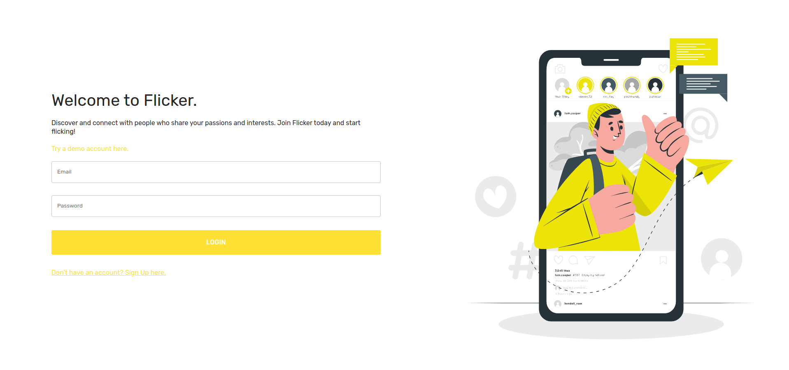
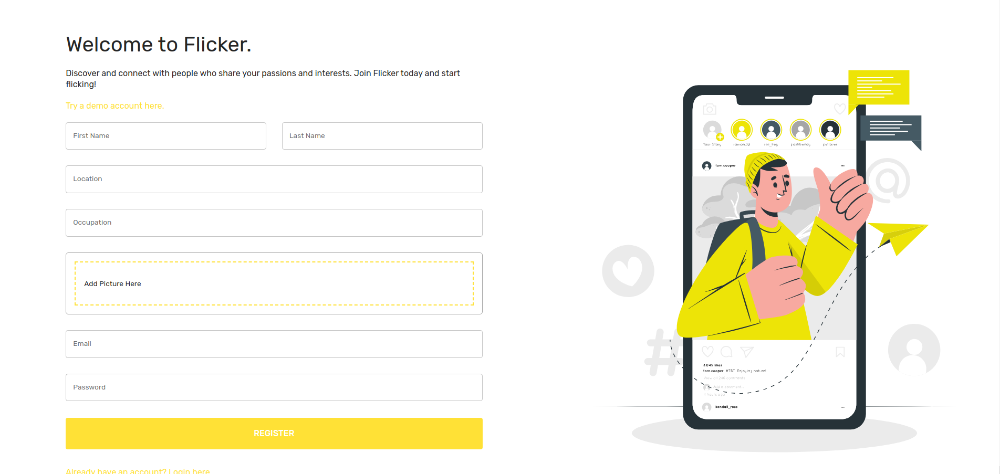
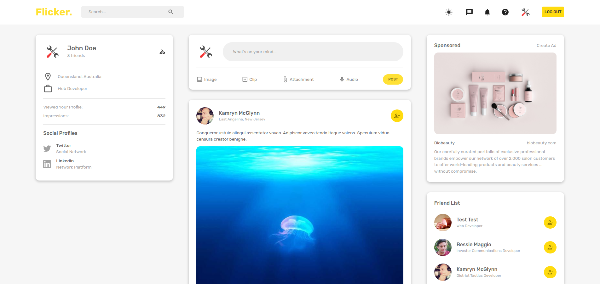
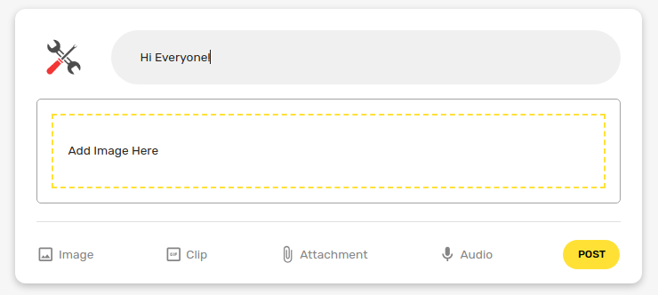
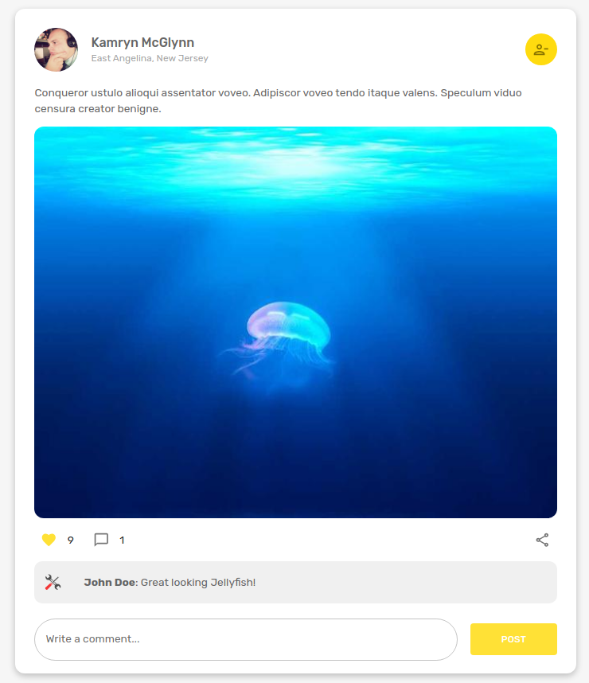
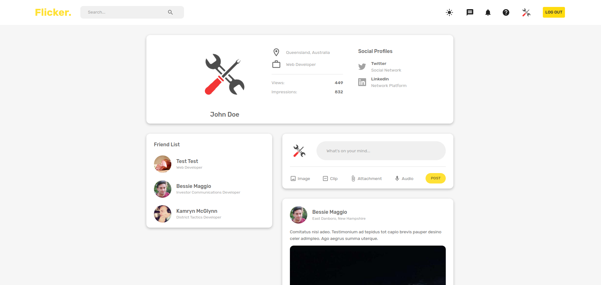
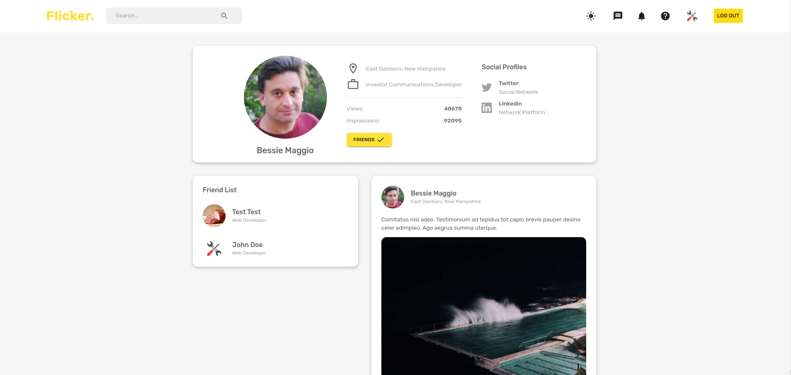

# Social Media App

🔗 [View Demo](https://social-media-app-el95.onrender.com/)

## Table of Contents
- [About The Project](#about-the-project)
- [Built With](#built-with)
- [Screenshots](#screenshots)
- [Features](#features)

## About The Project
A Social Media Website that primarily focuses on interactions between each user. 

## Screenshots

### Initial Screen
 

### Register Form
 

### Main Page

### Create Post

### Like & Comment

### User Profile (Logged-In)

### User Profile

[Back to Top](#social-media-app)

## Built With
- HTML
- CSS
- JavaScript
- Webpack
- React
- Node
- Express
- Bcrypt
- JSON Web Token
- MongoDB
- Material UI
- Formik
- Yup
- Redux Toolkit
- GridFS Storage
- Firebase

[Back to Top](#social-media-app)

## Features

- Log In & Sign Up Forms
- Demo Account
- Ability to Upload Profile Picture When Signing Up
- Authentication & Authorization
- Add Friends or Remove Friends
- Ability to Create Posts (With Text & Images)
- Ability to Like & Comment on Posts
- All Users Posts are Displayed
- User Profile Page Contains Profile Information, Friends & Posts Specific to That User
- Ability to Update Profile Picture
- User Widget, Posts Widget, Advertisment Widget & Friend List Widget
- Responsive User Interface
- Dark & Light Mode

[Back to Top](#social-media-app)
